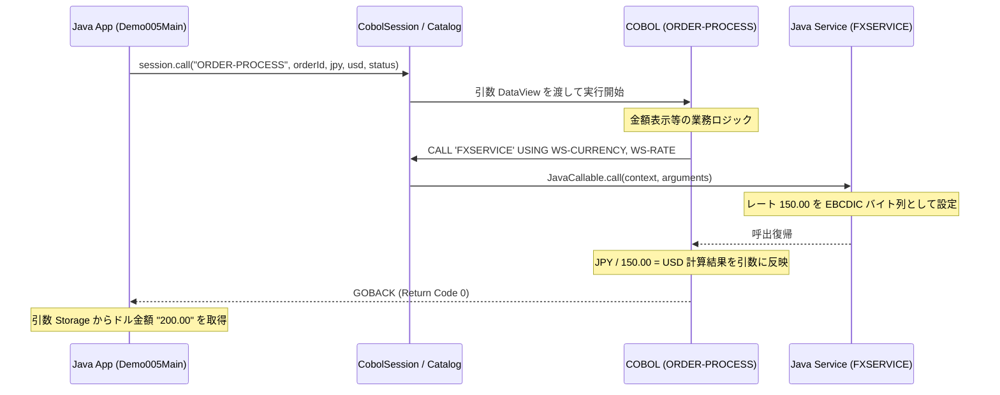

# デモ #005: Java ↔ COBOL 双方向相互運用 (Java Interop) デモ

本デモは、Java アプリケーションから翻訳済み COBOL プログラムを起動し、さらに COBOL プログラム内の `CALL` 文から Java サービスを逆呼び出し（コールバック）する **双方向相互運用（Java Interop）** の動作デモです。

`cobol-on-java` では、[設計 75 (Java 連携)](file:///d:/workspace/cobol-on-java/docs/design/75-java-interop.md) に基づき、Java と COBOL の境界で不要なデータコピーや文字コードの破壊を招かないよう、バイト指向 ABI (`DataView` / `Storage`) とセッション管理 (`CobolSession`) を提供しています。

---

## 構成ファイル

* [`ORDER-PROCESS.cbl`](file:///d:/workspace/cobol-on-java/demo/005/ORDER-PROCESS.cbl) : 受注処理 COBOL プログラム。
  - 受注番号、日本円金額を引数で受け取り、Java サービス `FXSERVICE` を `CALL` して最新の為替レートを取得。
  - 米ドル金額を計算して結果引数へ格納します。
* [`Demo005Main.java`](file:///d:/workspace/cobol-on-java/demo/005/Demo005Main.java) : Java 側メインアプリケーション。
  - `ProgramCatalog` に COBOL 生成クラス (`cobol.generated.ORDER_PROCESS`) と Java サービス (`FXSERVICE`) を登録。
  - `CobolSession` を開いて COBOL を呼び出し、変更された結果を検証します。
* [`run_demo.bat`](file:///d:/workspace/cobol-on-java/demo/005/run_demo.bat) : Windows 環境用一括ビルド・実行バッチファイル。

---

## 処理の流れ



---

## 実行方法 (Windows)

```cmd
demo\005\run_demo.bat
```

### 実行結果出力例
```text
==================================================
 [Java] cobol-on-java DEMO #005 (Java <-> COBOL)  
==================================================
[Java] Calling COBOL 'ORDER-PROCESS' from Java...
[Java] Input Order ID  : ORD100
[Java] Input Amount JPY: 30,000
--------------------------------------------------
[COBOL] ORDER-PROCESS STARTED for Order: ORD100
[COBOL] Input Amount (JPY):  30,000
  [Java Callback] FXSERVICE invoked for currency: 'USD'
  [Java Callback] Returning rate: 150.00 to COBOL
[COBOL] Acquired Exchange Rate from Java: 150.00
[COBOL] Converted Amount (USD)  :     200.00
[COBOL] ORDER-PROCESS COMPLETED (Status: OK)
--------------------------------------------------
[Java] COBOL Execution Finished. Return Code: 0
==================================================
[Java] Final Result in Java Application:
  - Status     : OK
  - Amount USD : 000200.00 USD
==================================================
```
