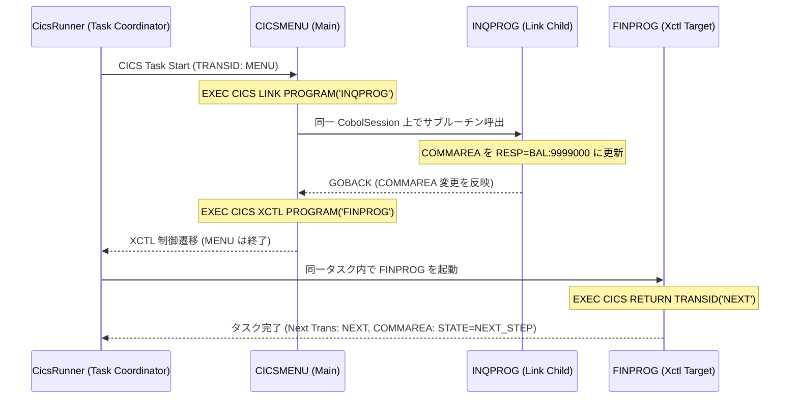

# デモ #007: CICS オンライントランザクション & 疑似会話制御デモ

本デモは、メインフレーム（z/OS）のオンライントランザクション処理モニタである **IBM CICS** のプログラム制御命令（`EXEC CICS LINK`, `EXEC CICS XCTL`, `EXEC CICS RETURN TRANSID`）を JVM 上で実行するデモです。

`cobol-on-java` の `cobol-cics` モジュール（[設計 77 (Spring Boot / CICS / Db2)](file:///d:/workspace/cobol-on-java/docs/design/77-spring-cics-db2.md) 準拠）は、Java EE / Web フレームワークに依存しない中立なタスク調整機構（`CobolCicsTaskProgram`）を提供し、COBOL プログラム間での同一タスク内セッション共有、COMMAREA の受け渡し、および疑似会話（Pseudo-Conversation）による次回トランザクションの予約を忠実に再現します。

---

## 構成ファイル

* [`CICSMENU.cbl`](file:///d:/workspace/cobol-on-java/demo/007/CICSMENU.cbl) : メニュートランザクション（`MENU`）の主 COBOL プログラム。
  - `EXEC CICS LINK PROGRAM('INQPROG')`: 副プログラムを呼び出し、更新された COMMAREA を受け取ります。
  - `EXEC CICS XCTL PROGRAM('FINPROG')`: コールスタックを解放し、次プログラムへ制御を遷移させます。
* [`INQPROG.cbl`](file:///d:/workspace/cobol-on-java/demo/007/INQPROG.cbl) : 照会副プログラム。LINK 元から渡された COMMAREA を更新して `GOBACK` で復帰します。
* [`FINPROG.cbl`](file:///d:/workspace/cobol-on-java/demo/007/FINPROG.cbl) : 完了処理プログラム。
  - `EXEC CICS RETURN TRANSID('NEXT') COMMAREA(...)`: 端末セッションへの疑似会話返却を行い、次回実行トランザクション `NEXT` を予約します。
* [`CicsDemoRunner.java`](file:///d:/workspace/cobol-on-java/demo/007/CicsDemoRunner.java) : CICS タスク実行ランナー。
* [`run_demo.bat`](file:///d:/workspace/cobol-on-java/demo/007/run_demo.bat) : Windows 環境用一括ビルド・実行バッチファイル。

---

## 処理フロー



---

## 実行方法 (Windows)

```cmd
demo\007\run_demo.bat
```

### 実行結果出力例
```text
==================================================
 [CICS] cobol-on-java DEMO #007 (CICS Transactions)
==================================================
[CICS Runner] Starting CICS Task: TRANSID='MENU'...
==================================================
[CICS:CICSMENU] Trans: MENU - Menu Program Started
[CICS:CICSMENU] LINKing to INQPROG with COMMAREA...
  [CICS:INQPROG] LINK child program executing.
  [CICS:INQPROG] Received COMMAREA: ACTION=INQ;ID=01
  [CICS:INQPROG] Updated COMMAREA and GOBACK.
[CICS:CICSMENU] Returned from INQPROG. Result: RESP=BAL:9999000
[CICS:CICSMENU] XCTL to FINPROG...
  [CICS:FINPROG] XCTL target executing in task.
  [CICS:FINPROG] Received COMMAREA: ACTION=FIN;ID=01
  [CICS:FINPROG] RETURN TRANSID(NEXT) with COMMAREA
==================================================
[CICS Runner] CICS Task Completed Successfully!
  - Returned COMMAREA: 'STATE=NEXT_STEP '
  - Next TRANSID (Pseudo-Conversation): NEXT
==================================================
```
