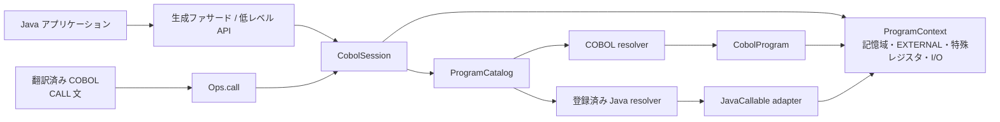
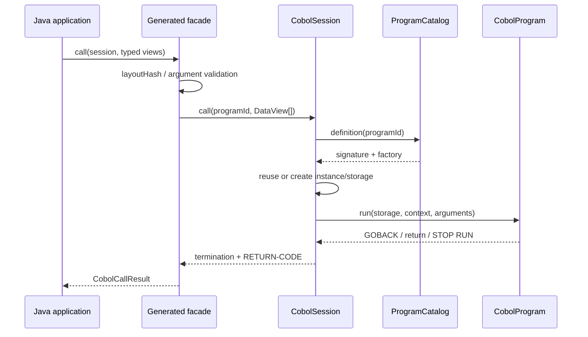

# 設計 75: Java 連携

| 項目 | 内容 |
| --- | --- |
| 対応要件 | ARC-2, ARC-4, ARC-7, FR-020, FR-027, FR-080〜FR-086, FR-142, FR-170, FR-172, FR-173, NFR-050, NFR-052, NFR-060, NFR-061 |
| 未充足要件 | IBM 非 OO static Java call と FR-171 の OO COBOL (`INVOKE` / `CLASS-ID` / `METHOD-ID`) は別設計が必要 |
| ステータス | 敵対的レビュー済み。ABI gate と FR-171 分離を反映、未実装 |

## 目的

同一 JVM 内で、次の双方向呼び出しを同じ COBOL 実行モデルの上に載せる。

1. Java アプリケーションから、翻訳済み COBOL プログラムを呼ぶ
2. COBOL の `CALL` 文から、アプリケーションが登録した Java 実装を呼ぶ

呼び出しの向きによって、文字コード、引数渡し、`WORKING-STORAGE`、`CANCEL`、
`RETURN-CODE`、診断の意味が変わってはならない。Java のオブジェクトモデルへ COBOL の
記憶域を無理に写すのではなく、既存の `Storage` / `DataView` を ABI として保つ。

プロセス間 RPC、JNI によるネイティブ COBOL 呼び出し、任意 Java メソッドの反射呼び出しは
この設計の対象外である。

## 設計原則

- **入口は2つ、実行路は1つ**: Java API と COBOL `CALL` は、同じカタログ、署名検査、
  セッション、呼び出しスタックを通る。
- **境界はバイト指向**: COBOL 内部の正本は常に `DataView` であり、Java 型への変換は
  生成ビューのアクセサでだけ行う。
- **公開するものを登録する**: COBOL 名を Java のクラス名やメソッド名として解釈しない。
- **実行状態を大域化しない**: `WORKING-STORAGE`、`EXTERNAL`、特殊レジスタ、ファイルは
  `CobolSession` が所有する。
- **正常な制御と障害を混ぜない**: `GOBACK`、`STOP RUN`、未解決、契約不一致、実行時異常を
  別の結果として保持する。

これらの判断は [ADR-0001](../decisions/0001-unified-program-resolution.md)、
[ADR-0002](../decisions/0002-byte-oriented-call-contract.md)、
[ADR-0003](../decisions/0003-execution-unit-and-lifecycle.md)、
[ADR-0004](../decisions/0004-call-failure-and-control-flow.md)、
[ADR-0011](../decisions/0011-separate-procedural-and-oo-java-interop.md) に記録する。残余リスクと
実装開始条件は[敵対的レビュー](../reviews/2026-09-09-interop-adversarial-review.md)に従う。

## 全体構成



`cobol-runtime` に公開 SPI と実行機構を置く。`cobol-compiler` はプログラム署名、レコード
ビュー、Java ファサード、生成物マニフェストを出力するだけで、Java アプリケーションを知らない。
`cobol-job` は Java API と同じ `CobolRuntime` / `CobolSession` を使う利用者へ移行する。

## コンポーネント

### `ProgramId`

COBOL のプログラム名を表す値オブジェクトである。文字定数またはデータ項目から得た名前は、
`ProgramNameCodec` が元の byte 列を dialect / code page ごとに検証してから文字列へ戻し、末尾空白を
除去し、許可された単一 byte 文字だけを正規形へ写像する。Unicode の一般的な大文字変換だけに依存しない。
空、制御文字、複数文字へ展開する文字、処理系の上限を超える名前は解決前に拒否する。異なる byte 列が
同じ正規形になる場合は catalog 構築時に衝突として拒否する。

カタログ、セッション内キャッシュ、`CANCEL`、トレースはすべて `ProgramId` をキーにする。
元の表記は診断用に別途保持できるが、検索キーにはしない。

### `ProgramSignature`

呼び出し可能なプログラムの機械可読な契約である。

```java
public record ProgramSignature(
        ProgramId programId,
        List<EntrySignature> entries,
        String layoutHash) {
}

public record EntrySignature(
        EntryId entryId,
        List<Parameter> parameters,
        Optional<ReturnDescriptor> returning,
        CallingConvention convention) {
}

public record Parameter(
        String name,
        int minimumBytes,
        int maximumBytes,
        Presence presence,
        PassingMode passingMode,
        DataDescriptor data,
        Direction direction,
        String recordType) {
}
```

- `entries` は主 entry と各 `ENTRY` の個別 USING / RETURNING 契約を持つ。
- `parameters` の順序は対象 entry の USING の順序である。
- `minimumBytes` / `maximumBytes` と `DataDescriptor` は固定長、dynamic length、category、usage、scale、
  pointer / addressability を表す。固定長では実長との一致を要求する。
- `presence` は `REQUIRED` / `OPTIONAL` であり、call argument の `OMITTED` と暗黙の末尾 omitted を
  DataView 長 0 と混同しない。
- `passingMode` は `REFERENCE`、`CONTENT`、将来の `VALUE` である。
- `direction` は Java 利用者向けの `IN` / `OUT` / `INOUT` という意図である。COBOL の
  記憶域保護機能ではなく、実行時に書き込みを禁止するものではない。
- `recordType` と `layoutHash` は生成した Java ビューと配備先の取り違えを検出する。
- `returning` は `CALL ... RETURNING` の出力専用契約である。RETURNING 使用時の `RETURN-CODE` 規則も
  entry signature の適合性試験へ含める。

上記は公開 API の最小要素を示す概念形である。`OMITTED`、`OPTIONAL`、`RETURNING`、`BY VALUE`、
`ENTRY` の positive / negative test vector が揃うまで Java record の形を互換 API として凍結しない。

COBOL の動的呼び出しには翻訳時に署名が分からないことがある。その場合も、カタログから解決した
定義の署名を呼び出し直前に検査する。署名を持たない既存 COBOL クラスは互換モードで呼べるが、
Java アダプタの登録では署名を必須とする。

### `ProgramCatalog` と `ProgramDefinition`

`ProgramCatalog` は構築後に変更できず `CatalogRevision` を持つ。アプリケーション起動時に、許可する
生成物と Java アダプタを登録する。各 `CobolSession` / CICS task は開始時の revision を pin し、同じ
実行単位の途中で hot deployment 後の定義を混在させない。`DYNAM` と `CANCEL` の再解決も pin した
revision 内で行う。新しい session だけが新 revision を選ぶ。

```java
ProgramCatalog catalog = ProgramCatalog.builder()
        .generatedCobol(CobolPrograms.fromPackage(
                "cobol.generated", applicationClassLoader))
        .javaProgram("CUSTLOOK", CustomerLookup.SIGNATURE,
                sessionServices -> new CustomerLookup(customerService))
        .build();
```

概念上、カタログは次の定義を返す。

```java
public record ProgramDefinition(
        ProgramId id,
        ProgramKind kind,
        ProgramSignature signature,
        ProgramFactory factory) {
}
```

`ProgramFactory` が返す実行対象は内部の共通 `ProgramEntry` へ合わせる。生成済み
`CobolProgram` はアダプタなしで `ProgramEntry` へ包める。Java 実装は後述の `JavaCallable` を
`CobolProgram` 相当の入口へ包み、作業場所が必要ならファクトリがセッション単位の状態を持つ。

同名定義はカタログ構築時の誤りである。クラスパスの並びや resolver の優先順位で片方を選ばない。

### `CobolRuntime` と `CobolSession`

`CobolRuntime` は共有可能な不変オブジェクトで、カタログと既定の実行設定を持つ。
`CobolSession` が1つの COBOL 実行単位であり、現在の `ProgramContext` が持つ可変状態を所有する。

Java の入口は、COBOL から呼ばれたものとして動かす `call` と、主プログラムとして動かす
`runMain` を分ける。`EXIT PROGRAM` は `call` では Java 呼び出し元へ戻り、`runMain` では何もせず
次の文へ進む。`GOBACK` はどちらも入口へ戻り、`STOP RUN` はどちらも実行単位を終了する。
この区別は呼び出し深度から推測せず、呼び出しフレームの `InvocationKind.EXTERNAL_CALL` または
`MAIN` に記録する。

```java
CobolRuntime runtime = CobolRuntime.builder(catalog)
        .defaultCodePage(CodePages.IBM_1047)
        .build();

try (CobolSession session = runtime.openSession(
        SessionOptions.builder().output(output).build())) {
    CobolCallResult result = session.call("CALCTAX",
            CobolArguments.byReference(request.view()));
}
```

セッションが保持するものは次のとおりである。

- 解決済みプログラムのインスタンスと `WORKING-STORAGE`
- 実行単位で共有する `EXTERNAL` 領域と特殊レジスタ
- コードページ、時計、入力、出力、データセットカタログ
- COBOL と Java を含む呼び出しスタック
- 実行トレースと診断設定
- 同時使用を検出する所有スレッドと再入深度

セッションは同時に複数スレッドから使用できない。同じスレッド上の
Java→COBOL→Java→COBOL という再入は許す。`JavaCallable` は呼出 thread 上で同期完了しなければならず、
別 thread、`CompletableFuture`、parallel stream へ `DataView` または transaction-bound service を渡さない。
非同期連携が必要なら immutable な copy-in / copy-out、task suspension、timeout、取消しを持つ別 API と
ADR を先に設計する。

### `JavaCallable`

COBOL へ公開する Java コードは、任意メソッドではなく次の SPI を実装して登録する。

```java
@FunctionalInterface
public interface JavaCallable {
    void invoke(JavaCallContext context, List<DataView> arguments) throws Exception;
}
```

`JavaCallContext` が公開するのは、登録したプログラム ID、コードページ、特殊レジスタの操作、
構造化ログ・トレースの入口、明示的な再入呼び出し API である。内部の可変 `ProgramContext` 全体や
クラスローダは公開しない。

Java 実装は生成したレコードビューを引数の `DataView` へ重ねて読む。

```java
final class CustomerLookup implements JavaCallable {
    static final ProgramSignature SIGNATURE = CustomerLookupContract.SIGNATURE;
    private final CustomerService service;

    CustomerLookup(CustomerService service) {
        this.service = service;
    }

    @Override
    public void invoke(JavaCallContext context, List<DataView> arguments) {
        CustomerRequest request = CustomerRequest.over(arguments.get(0), context.codePage());
        CustomerResponse response = CustomerResponse.over(arguments.get(1), context.codePage());
        service.find(request.customerId()).ifPresentOrElse(
                customer -> response.setName(customer.name()),
                () -> response.setStatus("NOTFOUND"));
    }
}
```

想定内の業務エラーは出力項目へ状態コードを書き、Java 例外で返さない。`DataView` とそこから
得た内部配列は呼び出し終了後に保持してはならない。

### 生成物マニフェスト

コンパイラはクラスと一緒に `META-INF/cobol/programs/<program-id>.json` を生成する。
マニフェストには最低限、次を含める。

- 形式バージョン
- 正規化済みプログラム ID と生成クラス名
- コンパイラバージョンと必要なランタイム ABI バージョン
- `ProgramSignature`
- 生成クラスを許可するパッケージ

カタログはマニフェストを先に読み、ABI バージョンと重複を検査してからクラスを初期化する。
マニフェストにない任意クラスを走査しない。移行期間だけ、現在の
`ProgramSupport.classNameOf` を使う明示的な互換 resolver を提供する。

## Java から COBOL を呼ぶ

### 型付き API

標準経路は、コンパイラが生成するプログラム別ファサードである。

```java
TaxRequest request = TaxRequest.allocate(runtime.codePage());
request.setAmount(new BigDecimal("1200.00"));

try (CobolSession session = runtime.openSession()) {
    CobolCallResult result = CalcTax.call(session, request);
    BigDecimal tax = request.tax();
}
```

ファサードは次を行う。

1. 自身の `layoutHash` とカタログの署名を照合する
2. 引数の個数、順序、長さを組み立てる
3. `BY REFERENCE` / `BY CONTENT` を明示して低レベル API を呼ぶ
4. 終了種別と `RETURN-CODE` を返す

ファサードは副プログラムの Java 公開 API なので `session.call` を使う。バッチ等の主プログラムを
Java プロセス内で起動する場合は `session.runMain(programId)` を使う。`runMain` は引数なしを既定とし、
OS プロセスを終了させず結果の `returnCode` をホストへ返す。

ビューの getter / setter は現在のランタイムの `CodePage`、`ZonedDecimal`、
`PackedDecimal`、`BinaryDecimal` 等を使う。Java の `String.getBytes()` や `double` を介した
独自変換を生成しない。

### 低レベル API

copybook がないプログラムや段階移行のため、`DataView` を直接渡す API も提供する。

```java
Storage storage = Storage.wrap(ebcdicBytes);
CobolCallResult result = session.call(
        ProgramId.of("CALCTAX"),
        List.of(CobolArgument.byReference(storage.whole())));
```

`byte[]` だけを受ける便宜 API は、所有権が曖昧になるため設けない。呼び出し元は
`Storage.wrap` なら同じ配列が更新され、`Storage.copyOf` なら独立した領域になることを選ぶ。

### 呼び出しシーケンス



同じセッション内の2回目の呼び出しは、カタログ検索結果とプログラム作業場所を再利用する。
`session.cancel("CALCTAX")` 後は初期像から生成する。

## COBOL から Java を呼ぶ

COBOL ソースの構文は通常の `CALL` を使い、Java 固有構文を追加しない。

```cobol
       CALL 'CUSTLOOK'
           USING BY REFERENCE LK-REQUEST LK-RESPONSE
           ON EXCEPTION
               MOVE 'CALLERR' TO LK-STATUS
       END-CALL
```

アプリケーション起動時に `CUSTLOOK` をカタログへ登録して初めて呼び出せる。処理は次の順である。

1. 生成コードが現在と同じく呼び先名と `DataView[]` を `Ops.call` へ渡す
2. セッションが名前を正規化し、カタログから定義を解決する
3. 登録署名に対して個数と長さを検査する
4. 呼び出し履歴へ種別 `JAVA` のフレームを積む
5. セッション用の Java アダプタを呼ぶ
6. 正常時はフレームを外し、`NOT ON EXCEPTION` があれば実行する

COBOL 呼び出し側が `BY CONTENT` とした引数は、既存の `Ops.byContent` が作った写しである。
Java 実装がそこへ書いても呼び出し元には反映されない。`BY REFERENCE` は同じ領域なので、
Java の書き込みが戻った直後から COBOL に見える。同じ領域を複数引数に渡した場合の重なりも保つ。

Java アダプタから COBOL を再入呼び出しするときは `JavaCallContext.call` を使う。新しい
セッションを開いてはならない。そうすると `EXTERNAL`、`RETURN-CODE`、呼び出し履歴が切れるためである。

## 呼び先の解決と `DYNAM` / `NODYNAM`

| 呼び方 | 定義を確かめる時期 | インスタンスを作る時期 | `CANCEL` 後 |
| --- | --- | --- | --- |
| 定数名 + `NODYNAM` | 生成物のリンク検査時、遅くともセッション開始時 | 最初の呼び出し時 | 同じ定義から初期状態で再生成 |
| 定数名 + `DYNAM` | 最初の呼び出し時 | 最初の呼び出し時 | カタログを再解決して再生成 |
| データ項目による動的 `CALL` | 呼び出し時 | その名前の最初の呼び出し時 | カタログを再解決して再生成 |

`NODYNAM` でも Java の直接メソッド呼び出しへ変換しない。カタログの署名、セッション、診断を
迂回すると呼び方によって意味が変わるためである。事前束縛するのは `ProgramDefinition` までとする。

## データ変換規則

| COBOL 側 | Java ビューの型 | 変換 |
| --- | --- | --- |
| `PIC X` / 集団項目 | `String` と生 `DataView` | セッションの `CodePage` で符号化・復号。末尾空白を勝手に除かない |
| `PIC 9` / `S9` DISPLAY | `BigDecimal` / `BigInteger` | `ZonedDecimal` と `PICTURE` の scale を使う |
| `COMP-3` | `BigDecimal` / `BigInteger` | `PackedDecimal` を使い、符号ニブルを保持する |
| `COMP` / `BINARY` | `BigDecimal` / `BigInteger` | `BinaryDecimal` と COBOL の桁切捨て規則を使う |
| `COMP-1` / `COMP-2` | `float` / `double` | 対応するホスト表現の変換を経由する |
| `REDEFINES` | 同じ `Storage` 上の複数アクセサ | コピーせず、同じ範囲へ別のビューを重ねる |
| `OCCURS` | 境界検査つき要素ビュー | COBOL の1起点を Java API で明示する |

`null` は COBOL 記憶域に対応しないため、引数や setter で受け付けない。空文字、空白、ゼロ、
LOW-VALUES 等はそれぞれ別の値として扱う。Java の日時や enum への業務固有変換は生成層へ
埋め込まず、アプリケーション層で行う。

## 終了と例外

`CobolCallResult` は次を返す。

```java
public record CobolCallResult(
        Termination termination,
        int returnCode,
        String diagnosticId) {
}
```

`Termination` は少なくとも `RETURNED` と `STOP_RUN` を持つ。Java から呼んだ最外プログラムの
`GOBACK` と手続き部末尾は `RETURNED` である。`STOP RUN` は `STOP_RUN` を返し、セッションを
終了状態にする。以後の呼び出しは失敗する。

`EXIT PROGRAM` の意味は Java API の入口で決まる。`call` は COBOL の外に Java の呼び出し元が
いるため `RETURNED` となり、`runMain` は主プログラムなので文を抜けない。現在の
`Ops.exitProgram` が使う「スタック深度が1なら主」という判定は `InvocationKind` の判定へ置き換える。

例外分類は次のとおりである。

- `CobolProgramNotFoundException`: カタログにない、許可されていない、生成クラスをロードできない
- `CobolCallContractException`: 引数個数、長さ、`layoutHash`、ABI バージョンが一致しない
- `CobolExecutionException`: COBOL の ABEND、未処理のデータ・ファイル異常、Java アダプタ例外
- `ConcurrentSessionUseException`: セッションの同時使用

COBOL の `ON EXCEPTION` は `CobolProgramNotFoundException` に相当する解決失敗だけを受け止める。
契約違反または開始後の異常を通常分岐へ変換しない。Java アダプタの `Exception` は
`CobolExecutionException` に包み、元の例外を cause に残す。`Error` と COBOL の内部制御例外は
通常のアダプタ例外として包まない。

これは登録 alias の規則であり、IBM 非 OO 形式 `CALL 'Java.class.method'` の互換規則ではない。同形式では
Java 例外も `ON EXCEPTION` 対象となり exception special register を設定するため、専用の call kind と
詳細設計なしに登録 alias へ読み替えない。

Java アダプタが `BY REFERENCE` 領域を書き換えたあと失敗しても、DB transaction の rollback は COBOL
storage を復元しない。呼出境界で自動 snapshot / rollback すると host semantics と性能を変えるため、
実機 oracle で確定するまで部分更新が観測され得るものとして扱う。失敗時書込みを前提にする業務は
compatibility test を必須とし、例外メッセージへ storage を自動出力しない。

## トランザクションと外部資源

ランタイムは Java アダプタが使う DB トランザクションを開始、commit、rollback しない。
トランザクション境界は Java ホストがセッションの外側に置く。Java アダプタには、ホストが
セッション作成時に登録したサービスやトランザクションコンテキストを注入する。

この原則は任意の業務 Java アダプタに対するものである。`EXEC SQL` と `EXEC CICS` は言語上の
トランザクション命令を持つため、専用の `UnitOfWorkPort` を通して管理する。Spring Boot 4.1 上での
具体的な境界は[設計 77](77-spring-cics-db2.md)に定める。

COBOL の異常終了を rollback へ対応付けるか、`RETURN-CODE` の非ゼロを業務失敗とみなすかは
アプリケーションの規則であり、ランタイムが推測しない。これにより、COBOL データセットの
close と外部 DB の commit 順序を暗黙に固定しない。

## セキュリティ

- カタログに明示されたプログラムだけを呼べる。
- 翻訳済み COBOL のクラスローダとパッケージをホストが許可する。
- Java アダプタは名前とファクトリをコードまたは検証済み構成から登録する。
- 動的 `CALL` の入力を完全修飾クラス名、メソッド名、URL、ファイルパスとして解釈しない。
- 重複名、ABI 不一致、不正なプログラム名は実行前または解決時に拒否する。
- ログ、トレース、例外メッセージへ引数値や生バイトを既定では出さない。
- 記憶域ダンプは既存の `DumpLevel` と NFR-052 のマスキング設定を通す。

この機構は登録済み Java コードを JVM 内で隔離するサンドボックスではない。登録コードの
ファイル、ネットワーク、資格情報へのアクセス権はホストプロセスの配備と監査で制御する。

## 可観測性

COBOL と Java をまたぐ各呼び出しに同じイベントを出す。

| 属性 | 内容 |
| --- | --- |
| `cobol.program.id` | 正規化済みプログラム ID |
| `cobol.program.kind` | `COBOL` または `JAVA` |
| `cobol.call.depth` | セッション内の呼び出し深度 |
| `cobol.call.dynamic` | 動的解決か |
| `cobol.termination` | `RETURNED`、`STOP_RUN`、`ABEND` 等 |
| `cobol.return_code` | 呼び出し後の特殊レジスタ値 |
| `cobol.diagnostic_id` | ログと Java 例外を結ぶ ID |

開始・終了時刻、所要時間、例外型を構造化ログと OpenTelemetry span へ載せる。引数の個数と
長さは載せられるが、値は載せない。Java→COBOL→Java の場合も親子 span を呼び出しスタックに
合わせる。

## 互換性とバージョニング

- ランタイム ABI、マニフェスト形式、生成 Java API は別々のバージョンを持つ。
- ABI のメジャーバージョン不一致はクラス初期化前に拒否する。
- copybook または `PROCEDURE DIVISION USING` の変更で `layoutHash` を変える。
- 項目名だけの変更でも生成 Java API は変わりうるため、ハッシュへ含める。
- 署名なしの既存 `CobolProgram` を呼べる互換 resolver は非推奨期間を設けたうえで廃止する。
- session / task は catalog revision を pin し、疑似会話をまたぐ場合は必要な program ABI revision を
  envelope に保存する。互換 revision がない場合は新旧 class の混在実行ではなく明示的な移行停止にする。

## 敵対的レビューで追加した実装開始ゲート

- `CALL` / `ENTRY` ごとの `OMITTED`、`OPTIONAL`、`RETURNING`、`BY VALUE` compatibility matrix を作る。
- 通常 `CALL` の Java adapter と FR-171 の OO `INVOKE` を同じ完了状態で報告しない。
- program name の raw byte、code page、正規化衝突を test vector で固定する。
- Java adapter の失敗前後の `BY REFERENCE` 可視性を IBM 実機または証拠レベルつき仕様試験で決める。
- hot deployment 中も一つの session / task が一つの `CatalogRevision` だけを見ることを検証する。

## 実装変更点

### `cobol-runtime`

`dev.cobolonjava.runtime.interop` を追加し、次を置く。

- `ProgramId`, `ProgramSignature`, `ProgramDefinition`, `ProgramCatalog`
- `ProgramResolver`, `ProgramFactory`, `JavaCallable`, `JavaCallContext`
- `CobolRuntime`, `CobolSession`, `CobolArgument`, `CobolCallResult`
- 公開例外型とマニフェスト読込器

`ProgramContext.resolve` の反射処理を resolver へ移し、`Ops.call` はセッションの共通 invoke 処理を
呼ぶ。`ProgramContext` 自体は段階的移行のため当面残し、セッションの内部状態として扱う。

現在の `CobolProgram.run` と `DataView[]` は生成クラス ABI として維持する。新しい共通入口が
これを包むため、既存生成クラスの一斉再生成を初期導入の前提にしない。

### `cobol-compiler`

- `PROCEDURE DIVISION USING` と LINKAGE の割付けから `ProgramSignature` を生成する
- プログラムマニフェストを class 出力と一緒に出す
- 指定された01レベル / copybook の型付きレコードビューを生成する
- 外部公開対象に対してプログラム別 Java ファサードを生成する
- `DYNAM` / `NODYNAM` の呼出しサイト情報を生成コードへ埋め込む

### `cobol-job`

`JobRunner` が直接 `runFresh` する箇所を、1ジョブまたは規定のステップ境界で開いた
`CobolSession` からの呼び出しへ移す。ジョブに登録するユーティリティも Java アダプタとして
カタログへ載せ、業務 Java スタブと同じライフサイクル・診断を使う。

## 段階導入

### 第1段階: 共通カタログと低レベル Java→COBOL API

- 現行クラス名規則を明示的な互換 resolver へ移す
- `CobolRuntime` / `CobolSession` と `DataView` ベースの `call` を追加する
- 現行 `CALL` のテストを同じ resolver 経由へ変更する
- 状態保持、`CANCEL`、`STOP RUN`、例外分類を固定する

### 第2段階: COBOL→Java 登録 SPI

- 署名必須の `JavaCallable` 登録を追加する
- `BY REFERENCE` / `BY CONTENT`、別名領域、再入呼び出しを検証する
- `cobol-job` の手書きユーティリティを同じ登録経路へ寄せる

### 第3段階: マニフェストと型付き生成 API

- コンパイラから署名とマニフェストを出力する
- copybook レコードビューとプログラムファサードを生成する
- ABI / `layoutHash` の事前検査を必須にする

### 第4段階: `DYNAM` / `NODYNAM` と `BY VALUE`

- 呼出しサイト単位の解決時期を実装する
- `CobolValue` の対応表現を定めて `BY VALUE` を追加する
- 互換 resolver と署名なし呼び出しの廃止条件を公開する

## テスト方針

業務 COBOL を JUnit 5 から実行し、外部サブルーチンや SECTION を Mock する利用者向け機構は
[設計 76](76-junit-testing.md)で定める。ここでは Java 連携そのものの契約テストを記す。

### 契約テスト

すべて V1 として、最低限次を固定する。

- プログラム名の大文字小文字、末尾空白、動的名の正規化
- 未登録名、同名登録、許可外パッケージ、ABI 不一致の拒否
- 引数なし、複数引数、個数不足、長さ不足、`layoutHash` 不一致
- `BY REFERENCE` の書戻し、`BY CONTENT` の非書戻し
- 同じ領域を2引数へ渡した場合のエイリアシング
- EBCDIC、ゾーン10進、パック10進、符号、小数点の往復
- 同じセッションでの `WORKING-STORAGE` 保持と `CANCEL` 後の初期化
- 別セッション間で `WORKING-STORAGE` と `EXTERNAL` が混ざらないこと

### 双方向シナリオ

| シナリオ | 確認事項 |
| --- | --- |
| Java→COBOL→復帰 | 型付きビューの更新、`RETURN-CODE`、`GOBACK` |
| Java→COBOL→COBOL | 呼び出し履歴、同じセッション、`CANCEL` |
| Java→COBOL→Java | 明示登録、署名検査、Java による書戻し |
| Java→COBOL→Java→COBOL | 再入、`EXTERNAL`、特殊レジスタ、span の親子関係 |
| COBOL→未登録名 | `ON EXCEPTION` / `NOT ON EXCEPTION` |
| COBOL→Java 例外 | ABEND 化、cause、部分更新後に通常分岐へ進まないこと |
| COBOL→Java→`STOP RUN` | 最外境界まで抜け、セッションを再利用できないこと |

### 並行性と資源

- 1セッションの別スレッド同時使用を決定的に拒否する
- 異なるセッションを並列実行して状態が混ざらない
- 正常、ABEND、`STOP RUN` のすべてでファイルと一時資源を閉じる
- Java の `call` と `runMain` で `EXIT PROGRAM` の振る舞いが異なる
- 例外とトレースに業務データが既定で含まれない

外部 DB やメッセージングを使う Java アダプタは、偽物の `JavaCallable` による単体試験と、
ホストアプリケーション側のトランザクション統合試験を分ける。ランタイムの試験が外部サービスへ
依存しないようにする。

## 受け入れ条件

- Java から型付きファサードと低レベル API の両方で翻訳済み COBOL を呼べる。
- COBOL の通常の `CALL` から、明示登録した Java 実装を呼べる。
- この受け入れ条件は手続き型連携だけを対象とし、FR-171 の OO `INVOKE` 完了を意味しない。
- 両方向で参照渡し、内容渡し、エイリアシング、コードページが一致する。
- 同じセッションでは作業場所が残り、`CANCEL` 後は初期状態へ戻る。
- 動的 `CALL` から許可外の Java クラスまたはメソッドを指定できない。
- `GOBACK`、`STOP RUN`、未解決、契約不一致、実行失敗を呼び出し側が区別できる。
- COBOL と Java をまたぐ呼び出し履歴と構造化トレースを1本の実行として取得できる。
